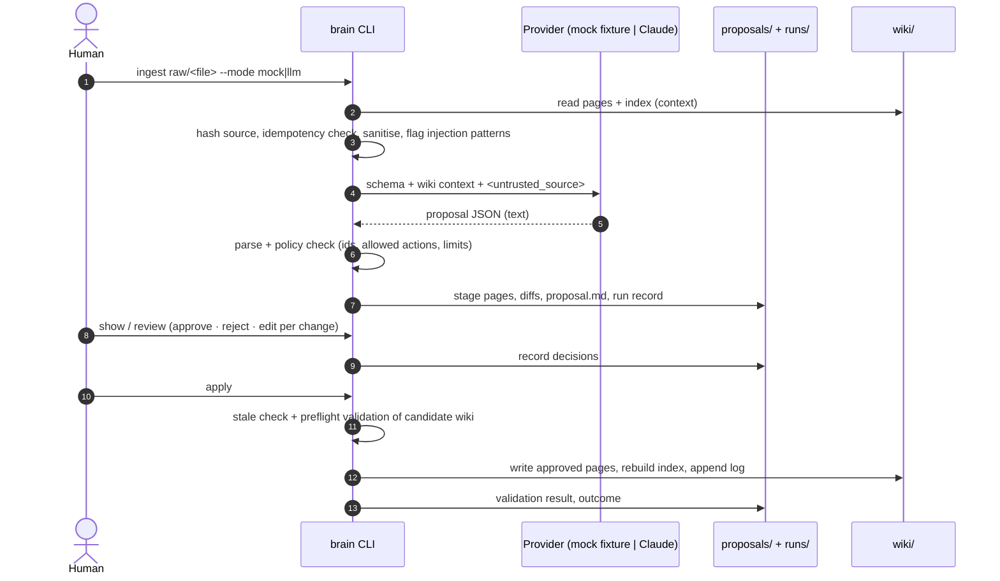

# Architecture and end-to-end flow

A small Python CLI (`brain/`, standard library only) that turns an immutable raw source into
reviewed, linked Markdown knowledge. One LLM call per ingest, no agents, no database, no services.

## Components

| Module | Responsibility |
|---|---|
| `brain/cli.py` | `init`, `add`, `ingest`, `show`, `review`, `apply`, `validate`, `status`, `reindex` |
| `brain/ingest.py` | The pipeline: build context → call provider → policy-check the proposal → stage → record review → preflight → write → index → log |
| `brain/providers.py` | `MockProvider` (hand-authored fixture) and `AnthropicProvider` (Claude via the official SDK). Same input (`ProposalRequest`), same output (raw text) |
| `brain/validate.py` | Quality checks on a wiki state — on disk, or an in-memory candidate before writing |
| `brain/pages.py` | Page format: front matter, `[[links]]`, deterministic index |
| `brain/workspace.py` | Layout, hashing, the single guarded write path, secret redaction |
| `schema/WIKI_SCHEMA.md` | The contract: page structure, linking, proposal format, allowed changes, review rules. Sent verbatim to the model |
| `tools/demo.py` | Runs the sample scenario through the real CLI, exports site data, verifies consistency |
| `tools/make_replay_video.py` | Renders the replay video from the exported run data |

## Workspace layout

```
<workspace>/
  raw/                 immutable sources (human-owned; the engine never writes here)
  wiki/concepts/*.md   concept pages          ┐
  wiki/sources/*.md    one page per source    │ generated knowledge, written only by `apply`
  wiki/index.md        catalogue (engine-generated)
  wiki/log.md          append-only ingest log ┘
  proposals/<run>/     staged proposal: prompt.txt, response.json, pages/, proposal.md, before/
  runs/<run>.json      audit record for each run
```

## End-to-end flow



Nothing reaches `wiki/` before step 11, and step 11 happens only for changes a human approved.

### Stages as recorded in `runs/<run>.json`

| Stage | Command | Writes to wiki/? | Fails when |
|---|---|---|---|
| `read_source` | ingest | no | file outside `raw/`, too large |
| `inspect_wiki` | ingest | no | unparseable page |
| `propose` | ingest | no | provider error, refusal, truncation, missing key |
| `check_proposal` | ingest | no | invalid JSON, unsafe ids, disallowed actions, > 8 changes, missing source page |
| `stage` | ingest | no | — |
| `review` | review | no | a change without a decision |
| `preflight` | apply | no | raw changed, stale target page, candidate wiki invalid |
| `write`, `index`, `log` | apply | **yes** | — (preflight already passed) |
| `validate` | apply | no | recorded in the run; `brain validate` exits non-zero |

## Key design decisions

- **Full-page proposals, engine-owned metadata.** The model returns full page Markdown (easy to review as a diff). The engine overwrites `id`, `type`, `updated`, `raw_path`, `raw_sha256` — provenance never depends on model output.
- **Index is deterministic; links are not.** The index is generated from front matter. Cross-links come from the proposal (the model decides which relationships are meaningful) and are validated, not invented, by code.
- **Validate the candidate, then write.** `apply` assembles the post-apply wiki in memory and validates it first. A broken link introduced by a human edit or by rejecting a page others depend on stops the apply with nothing written.
- **Idempotency by content hash.** A source whose `sha256` already appears on a source page is a no-op; a source with a pending proposal is reported, not re-proposed.
- **Rollback material.** Pre-apply copies of every touched file are kept in `proposals/<run>/before/`.
- **Mock through the same path.** The mock provider returns text; everything after that (parse, checks, staging, review, apply, validation) is shared with the LLM path.

## Deliberate limits

- The whole wiki is sent as context. Fine for tens of pages; a larger wiki would need page selection (e.g. index-guided retrieval) before the call.
- Writes are atomic per file, not across files. Preflight makes a mid-apply failure unlikely; `before/` copies allow manual rollback.
- Single user, local files; no locking for concurrent runs.
